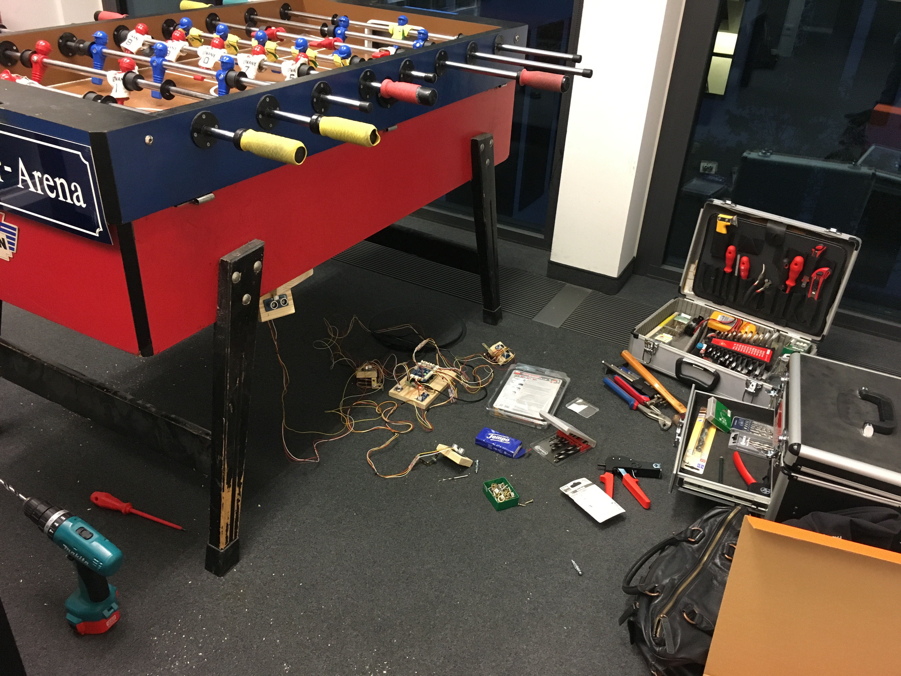
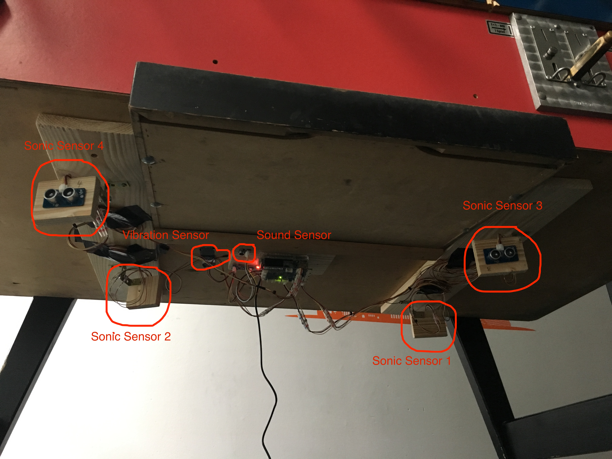

# Tischkicker Monitor @Jambit

## Motivation
This project aims for monitoring our Tischkicker in our office. We frequently have the problem that the table is already occupied during peak times around lunch or in the late afternoon. Our office is distributed on multiple floors, hence it takes some time to walk for a short match. Usually you need to wait in an already long queue in front of it or you will come back later. If you are lucky, you'll find a free table, if not it's already in use again by your beloved colleagues.
To avoid situations like this, I equipped the table with several sensors which are exposed by a RESTful API. It can be used to develop custom frontends like tray icon applications, Android apps or web applications. Feel free to develop whatever you like and offer it to your colleagues so that everybody can use it as well. As you know, sharing is caring. ;)

## Available Sensors
The following sensors are currently available:

* [Sound Sensor Service](http://kicker-aka.jambit.com/soundsensor/v1/api/) - Offers the sound intensity around the table
* [Vibration Sensor Service](http://kicker-aka.jambit.com/vibrationsensor/v1/api/) - Offers the vibration level of the table

### Planned Sensors (testing phase)
* [Ultra Sonic Sensor Service](http://kicker-aka.jambit.com/sonicsensor/v1/api/) - Offers the distance between the table and the players

If you are missing a sensor, check out this [lists of supported sensors](http://wiki.seeed.cc/Grove/) and feel free to contribute to this project. :)

## Architecture

Each sensor service is designed as a single microservice which is implemented using NodeJS running on a RaspberryPi 3 offering RESTful webservices via HTTP. The sensors are connected via a pretty neat technology called GrovePi and is very easy to extend.
[GrovePi](https://www.dexterindustries.com/grovepi/) is created by Dexter Industries as a Kickstarter project which aims for simplifying IoT application development. The GrovePi is an add-on board for the Raspberry Pi that connects modular sensors to the RPi GPIO connectors. GrovePi was developed and launched in partnership with Seeed Studio, an electronics manufacturer. The result is a rich selection of sensors, actuators and more components which can be used with multiple programming languages by almost as easy as "plug&play".

For this services an api first approach is used with [NodeJS](https://nodejs.org/en/) and  [Swagger-Express-MW](https://www.npmjs.com/package/swagger-express-mw). Based on the defined API ([see swagger's OAI](https://swagger.io/introducing-the-open-api-initiative/)) the skeleton is created and then modified for the specific sensors. The sensors are connected via [node-grovepi](https://www.npmjs.com/package/node-grovepi) module. The services itself are managed by the process manager [PM2](http://pm2.keymetrics.io/). To offer a standardized interface and preserve flexibility nginx is used as reverse proxy.

## Hardware Assembly
The ultra sonic sensors are mounted on two wooden boards which are fixed with two screws on a mounting threat. For transportation of the table just remove those two screws for each board and you can remove the wooden boards. The RPi, the sound sensor and the vibration sensor are mounted on a wooden board as well which is fixed by a screw and a mounting thread as well.  

In the following you'll find some images of the implementation and the final result.

## Contribute
If you're interested in this project or you just want more sensors or more information offered by the existing sensors please contact me in person in my office, via [email](michael.kirsch@jambit.com) or just simply [create an issue](https://github.com/waspmuc/tischkickermonitor/issues/new) on github for this project or go directly the corresponding repository.

The related repositories for each sensor can be found here
* [Sonic Sensor Service repository](https://github.com/waspmuc/sonic-sensor-service)
* [Sound Sensor Service repository](https://github.com/waspmuc/sound-sensor-service)
* [Vibration Sensor Service repository](https://github.com/waspmuc/vibration-sensor-service)

Cheers,  
Cherry
